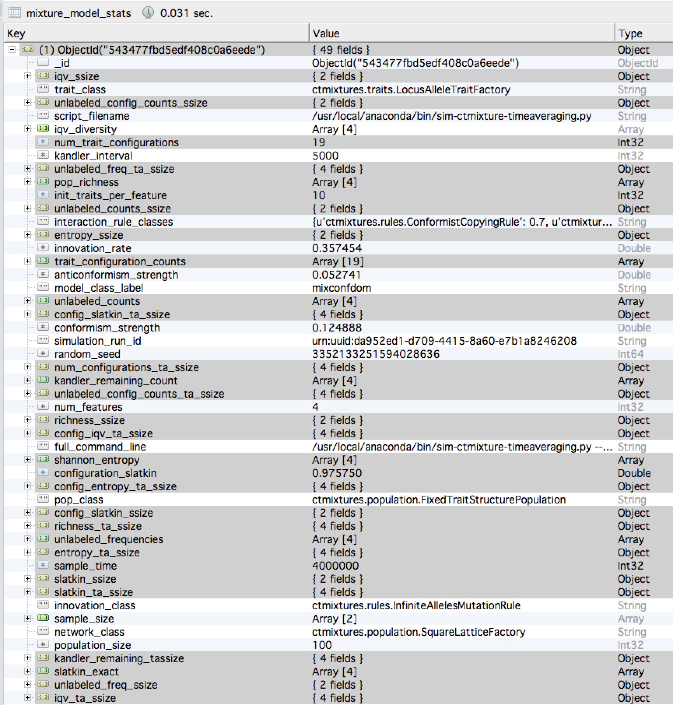

# docker-ctmixtures

Docker container which runs v2.5 of the CTMixtures simulation software, written by Mark E. Madsen, 
University of Washington.  

## Overview and Purpose ##

This Docker container builds from a base image `phusion/baseimage:latest` which is capable of 
running multiple daemon processes (i.e., it runs a standard Unix `init` process).  This allows 
MongoDB to be running on the same container as the simulation code, and thus presents an "all in one"
container for demonstrating the simulation software or running small numbers of replications.  

CAVEAT:  Replicating the entire simulation output used in repository [experiment-ctmixtures](https://github.com/mmadsen/experiment-ctmixtures) and for the paper contained therein will require a cluster computing approach, since the original data set took 5 days on a StarCluster of 4 EC2 instances with 16 vCPUs each (see [lab notes](http://notebook.madsenlab.org/project:coarse%20grained%20model/model:ctmixtures/experiment:experiment-ctmixtures/2014/11/07/ctmixtures-analysis-randomforests.html) for more details).    

## Building the Container ##

The Dockerfile does the following:

1.  Adds the latest version of Anaconda Scientific Python to the container
1.  Adds MongoDB to the base `phusion/baseimage:latest` Linux distribution
1.  Sets up MongoDB to run as a daemon that is started at boot using the `runit` replacement for SysV init.
1.  Adds `git`, `wget`, and standard C/C++ compiler tools which are needed for some simulation components.  
1.  Adds `SWIG` code generation tools, which are needed to compile the C to Python link code for Slatkin Exact neutrality testing.  
1.  Downloads the tagged Version 2.5 release of `CTMixtures` from Github, and unpacks it.  
1.  Compiles the Slatkin Exact module and installs it to the Anaconda library.
1.  Adds the remaining pure-Python module dependencies via a `requirements.txt` file

There are a fair number of download and build steps for this container, so it may take a few minutes initially, even with access to fast download speeds.  

While sitting in the `docker-ctmixtures` directory, build this container as follows:

`docker build -t mmadsen/docker-ctmixtures .`


## Running the Container ##

The resulting container can be run as follows:

`docker run --rm -it -p 27017:27017 mmadsen/docker-ctmixtures`

There will be some startup messages (one takes a second to appear), and then you will be deposited at the root command line in the container, in the actual simulation software directory `/root/v2.5`.  If you run `ps aux`, you should see the `mongodb` process running in the background.

## Running a Simulation ##

To run a simulation, there is an example in the file `example-simulation-job.sh`.  This excerpts several actual command lines for simulation runs used in the `experiment-ctmixtures` analysis and final paper.  The associated configuration file for non-command-line parameters is in the `conf` directory and listed on the command lines in this example script.  

You can run alternative simulations (say, increasing the innovation rate) by copying the command line and modifying values.  Modifying parameters to nonsensical values may cause the simulation to stop working, just as a caveat.  The system is designed to sweep a well-defined and large parameter space as efficiently as possible, since such sweeps may take days or weeks even on a compute cluster.  The simulation code was not designed to be interactive.  So...just a warning.  

For example, innovation rates are real numbers equal to or greater than 0.0, and are the whole population rate of innovations per unit time.  The behavior is undefined if you give it a negative innovation rate, but any positive real number should be valid.  Population sizes should be integers, and so on.  

Run the example simulation as follows:

`sh example-simulation-job.sh`

and since debug output is turned on for this example, you should see:

```shell
root@ffdd8805477a:/root/v2.5# sh example-simulation-job.sh
2015-02-15 17:40:55,470 DEBUG: Seeding RNGs with seed: 988924085664279983
2015-02-15 17:40:55,471 DEBUG: experiment name: equifinality-3
2015-02-15 17:40:55,471 DEBUG: configured theta = 1.35554193845, using all-loci innovation rate: 0.054221677538
2015-02-15 17:40:55,472 DEBUG: Equifinality model class: allneutral
2015-02-15 17:40:55,472 DEBUG: Configuring CT Mixture Model with structure class: ctmixtures.population.FixedTraitStructurePopulation graph factory: ctmixtures.population.CompleteGraphFactory interaction rule: {u'ctmixtures.rules.NeutralRandomLocusCopyingRule': 1.0}
2015-02-15 17:40:55,473 DEBUG: max TA interval: 100
2015-02-15 17:40:55,473 DEBUG: Kandler survival interval in generations: 50  timesteps: 5000
2015-02-15 17:40:55,473 DEBUG: starting Kandler survival interval tick: 3985000
2015-02-15 17:40:55,473 DEBUG: starting Kandler survival interval tick: 3990000
2015-02-15 17:40:55,581 DEBUG: starting TA sampler intervals: [(3984000, 3985000), (3982500, 3985000), (3980000, 3985000), (3975000, 3985000)]
2015-02-15 17:40:55,582 DEBUG: ending TA sampler intervals: [(3990000, 3991000), (3990000, 3992500), (3990000, 3995000), (3990000, 4000000)]
2015-02-15 17:40:55,582 DEBUG: earliest sample time: 3975000
2015-02-15 17:40:55,582 DEBUG: kandler interval start time: 3985000
2015-02-15 17:40:55,582 DEBUG: kandler interval stop time: 3990000
2015-02-15 17:40:55,582 DEBUG: Minimum stationarity time: 8976.52283026
2015-02-15 17:40:55,614 DEBUG: creating 100 obj for rule ctmixtures.rules.NeutralRandomLocusCopyingRule
2015-02-15 17:40:55,618 DEBUG: Kandler tracking interval start: 3985000  stop: 3990000
2015-02-15 17:40:55,621 INFO: Starting urn:uuid:f2db30df-facd-4568-845c-bf0fa739f787
2015-02-15 17:40:55,816 DEBUG: time: 10000  copies by locus: [2521, 2532, 2437, 2510]  innovations: 529 innov by locus: [139, 146, 119, 125]
2015-02-15 17:40:55,987 DEBUG: time: 20000  copies by locus: [5026, 5039, 4954, 4981]  innovations: 1103 innov by locus: [280, 302, 256, 265]
2015-02-15 17:40:56,132 DEBUG: time: 30000  copies by locus: [7487, 7565, 7447, 7501]  innovations: 1674 innov by locus: [417, 448, 396, 413]
2015-02-15 17:40:56,279 DEBUG: time: 40000  copies by locus: [10015, 10034, 9993, 9958]  innovations: 2199 innov by locus: [554, 577, 535, 533]
2015-02-15 17:40:56,427 DEBUG: time: 50000  copies by locus: [12449, 12506, 12507, 12538]  innovations: 2739 innov by locus: [691, 709, 668, 671]
2015-02-15 17:40:56,577 DEBUG: time: 60000  copies by locus: [14970, 14954, 15001, 15075]  innovations: 3265 innov by locus: [821, 828, 821, 795]
2015-02-15 17:40:56,767 DEBUG: time: 70000  copies by locus: [17431, 17432, 17513, 17624]  innovations: 3782 innov by locus: [964, 963, 942, 913]
2015-02-15 17:40:56,972 DEBUG: time: 80000  copies by locus: [19940, 19941, 20031, 20088]  innovations: 4323 innov by locus: [1105, 1097, 1084, 1037]
2015-02-15 17:40:57,130 DEBUG: time: 90000  copies by locus: [22426, 22526, 22487, 22561]  innovations: 4857 innov by locus: [1242, 1229, 1211, 1175]
2015-02-15 17:40:57,274 DEBUG: time: 100000  copies by locus: [24892, 25021, 24978, 25109]  innovations: 5381 innov by locus: [1371, 1356, 1357, 1297]
```

and so on.  The output will continue for 4 million steps, at which point various samples of the population are taken and written to the MongoDB database.  No output is written to the database until the sampling steps at the end, so the database will be empty if you look during the simulation run itself.  

Once the simulation run is complete, we can look at some of the results by invoking the `mongo` command line client as follows:

```shell

root@39ff3b7f687f:/root/v2.5# mongo

MongoDB shell version: 2.6.7
connecting to: test
Welcome to the MongoDB shell.
For interactive help, type "help".
For more comprehensive documentation, see
	http://docs.mongodb.org/
Questions? Try the support group
	http://groups.google.com/group/mongodb-user
2015-02-15T17:15:58.935+0000 In File::open(), ::open for '' failed with errno:2 No such file or directory

> show dbs
admin                       (empty)
equifinality-3_samples_raw  0.078GB
local                       0.078GB

> use equifinality-3_samples_raw
switched to db equifinality-3_samples_raw

> show collections
mixture_model_stats
simulation_timing
system.indexes

> db.mixture_model_stats.find().count()
1

```

The above shows that the simulation created one "database":  `equifinality-3_samples_raw`, containing the raw samples from the `equifinality-3` experiment (specified in our simulation command line, above).  

Inside that database are two "collections":  `mixture_model_stats`, which contains the primary output of the simulation, and `simulation_timing` which contains timing statistics for each simulation run.  This output is very useful in planning large batches of simulation runs.  

We can also see that there is now one row in the `mixture_model_stats` database.  This row is not reproduced here, because the data are very large.  Each row contains 49 data fields, many of which are nested dictionaries and arrays recording snapshots of values from the simulated population.  The 49 data fields are shown here:  .

The grey highlighted rows are sample data, while the unhighlighted rows with white background are configuration parameters and bookkeeping data for this simulation run.  Each simulation run has a globally unique identifier or UUID, which is unique across simulations, simulation code bases, systems, etc.  The simulation parameters, full command line from the execution of the simulation, and code classes specifiying each copying rule are all stored within the database row, allowing one to understand what the data row represents even if you don't have access to the original scripts which ran the simulation (to a certain extent). 

Each database row also records the random number seed used to execute that simulation run.  These seeds are chosen randomly across the entire batch of simulation runs, but are recorded with each run for a balance of good stochasticity in the simulation itself, but full replicability.  


